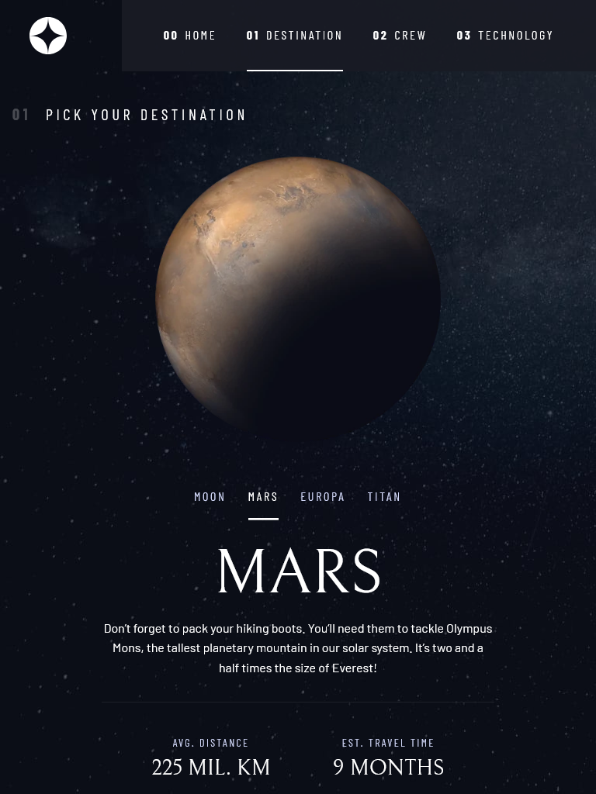
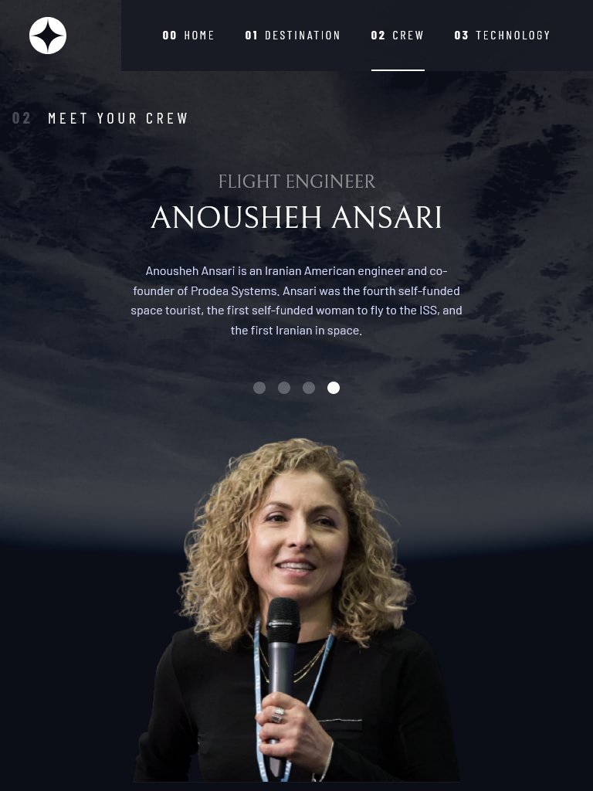
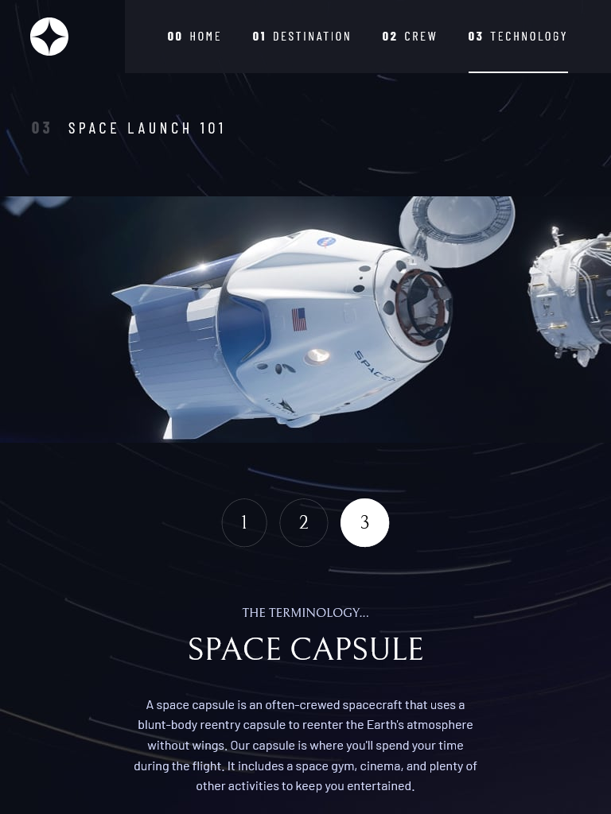

# Frontend Mentor - Space tourism website solution

This is a solution to the [Space tourism website challenge on Frontend Mentor](https://www.frontendmentor.io/challenges/space-tourism-multipage-website-gRWj1URZ3). Frontend Mentor challenges help you improve your coding skills by building realistic projects. 

## Table of contents

- [Overview](#overview)
  - [The challenge](#the-challenge)
  - [Screenshot](#screenshot)
  - [Links](#links)
- [My process](#my-process)
  - [Built with](#built-with)
  - [What I learned](#what-i-learned)
  - [Continued development](#continued-development)
  - [Useful resources](#useful-resources)
- [Author](#author)
- [Acknowledgments](#acknowledgments)


## Overview

### The challenge

Users should be able to:

- View the optimal layout for each of the website's pages depending on their device's screen size
- See hover states for all interactive elements on the page
- View each page and be able to toggle between the tabs to see new information

### Screenshot






### Links

- Solution URL: [Add solution URL here](https://your-solution-url.com)
- Live Site URL: [Add live site URL here](https://your-live-site-url.com)

## My process

### Built with

- Semantic HTML5 markup
- CSS custom properties
- Flexbox
- CSS Grid
- Mobile-first workflow
- Vanilla JavaScript

### What I learned

A lot of great accessibility features like the media query below as well as my first time implementing a feature query.

```css
@media (prefers-reduced-motion: reduce) {  
  *,
  *::before,
  *::after {
    animation-duration: 0.01ms !important;
    animation-iteration-count: 1 !important;
    transition-duration: 0.01ms !important;
    scroll-behavior: auto !important;
  }
}
```
```css
@supports (backdrop-filter: blur(1rem)) {
  .primary-navigation {
    background: hsl( var(--clr-white) / 0.04);
    backdrop-filter: blur(1.4rem);
  }
}
```

### Continued development

Getting comfortable with CSS Grid is still very much a work-in-progress and a topic I'll be spending a fair amount of time on in the near future. Additionally, I'm looking forward to using CSS custom properties in many more projects moving forward as well as focusing on proper accessibility markup.

### Useful resources

- [Scrimba - Build a space travel website](https://scrimba.com/learn/spacetravel) - Watching this course taught by Kevin Powell was tremendously useful in learning how to break down a relatively complex multi-page layout into manageable pieces. Kevin's instruction on CSS best practices is invaluable.

## Author

- Frontend Mentor - [@MattPahuta](https://www.frontendmentor.io/profile/MattPahuta)
- Twitter - [@MattPahuta](https://twitter.com/MattPahuta)

## Acknowledgments

A huge thanks to [@KevinJPowell](https://twitter.com/KevinJPowell) and [@scrimba](https://twitter.com/scrimba) for the foundational instruction that helped me piece this project together.
